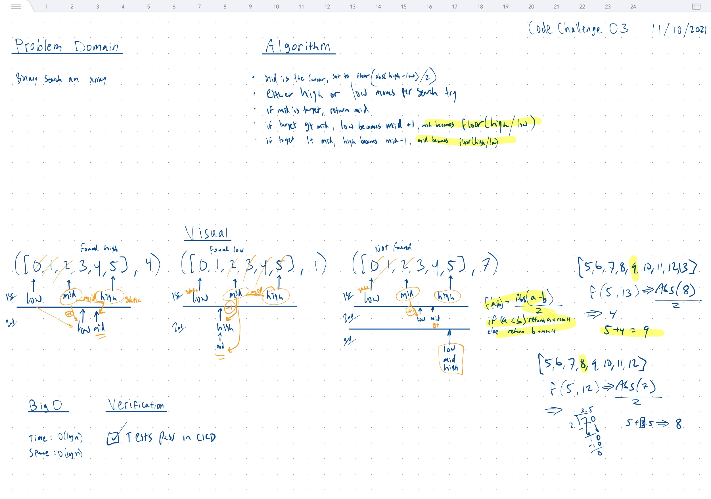

# Array Binary Search

## Strategy

### Midpoint Algorithm

- Using f(a,b) => Abs(a-b)/2
  - if (a < b), Mid = floor(f(a, b)) + a
  - else, Mid = floor(f(a, b)) + b

## Whiteboard



## Tests

``` bash
cd javascript
npm run 'test:code-challenge-class-03'
```
