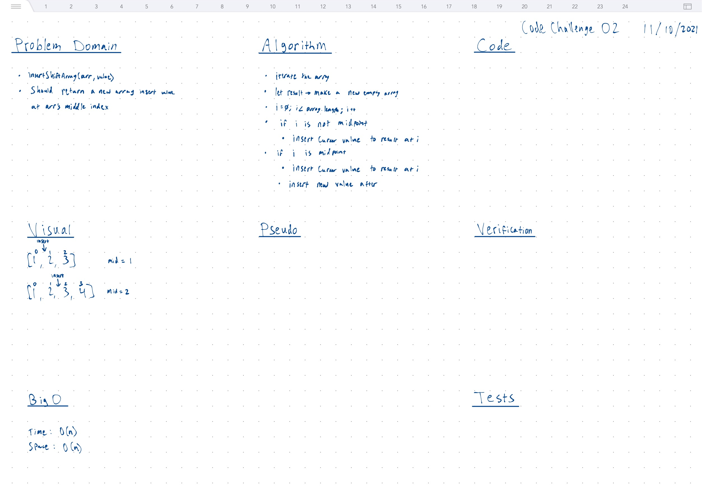

# Array Insert Shift

## Strategy

- Iterate array
- let result -> make a new empty array
- i = 0; i < array.length; i++
- if i is not midpoint
  - insert cursor value to result at i
- if i is midpoint
  - insert career value to result at i
  - insert new value after

## Whiteboard



## Tests

``` bash
cd javascript
npm run 'test:code-challenge-class-02'
```
