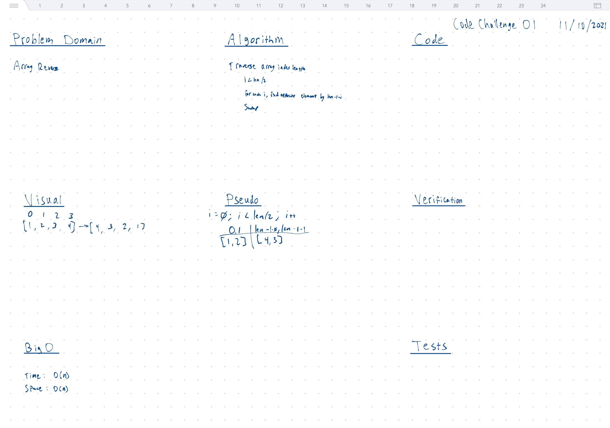

# Array Reverse

## Strategy

- Iterate array
- Start at i = 0
- Loop until i < array length / 2
- Increment i by 1
- For each i, swap array[i] with array[array.length - 1 - i]
- Return result as new array

## Whiteboard



## Tests

``` bash
run 'test:code-challenge-class-01'
```
