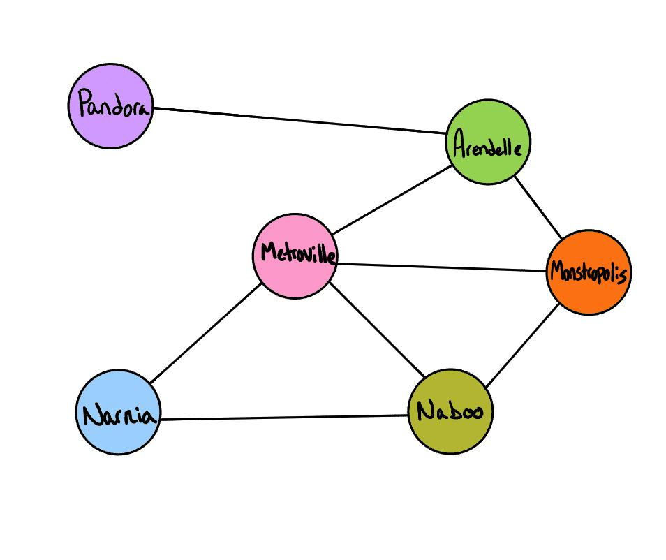

# HashMap Repeated Words Challenge Summary
<!-- Description of the challenge -->

Write the following method for the Graph class:

- breadth first
  - Arguments: Node
  - Return: A collection of nodes in the order they were visited.
  - Display the collection

## Strategy

### Whiteboard Process
<!-- Embedded whiteboard image -->



### Approach & Efficiency
<!-- What approach did you take? Why? What is the Big O space/time for this approach? -->

- Big O time for graph traversal here is O(Edges + Vertices).
- Big O space for graph traversal here is O(Edges + Vertices) as well.

### Solution
<!-- Show how to run your code, and examples of it in action -->

Tests can be run with `npm run test:code-challenge-class-36`.

## Tests

``` bash
cd javascript
npm run 'test:code-challenge-class-36'
```
