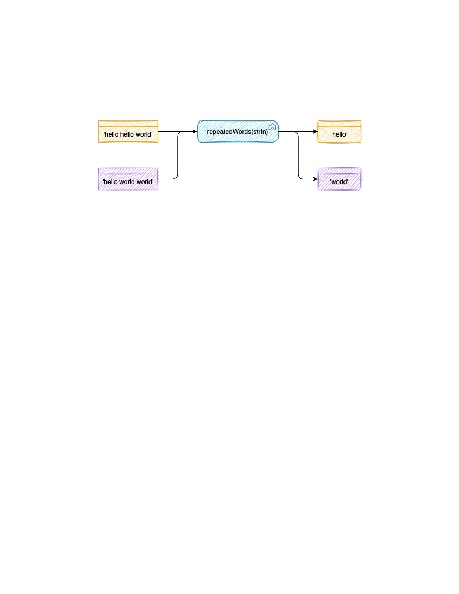

# HashMap Repeated Words Challenge Summary
<!-- Description of the challenge -->

- Write a function called repeated word that finds the first word to occur more than once in a string.

## Strategy

### Whiteboard Process
<!-- Embedded whiteboard image -->



### Approach & Efficiency
<!-- What approach did you take? Why? What is the Big O space/time for this approach? -->

I decorated a JavaScript Set with my HashMap class to get an unbiased implementation.

I designed my words algorithm for O(n) space and time complexity.

The input string is split and then traversed only once, therefore the time complexity is O(n);

The lookups in the hashmap are O(1) and insignificant on the time complexity of the higher-order algorithm.

### Solution
<!-- Show how to run your code, and examples of it in action -->

Tests can be run with `npm run test:code-challenge-class-31`.

## Tests

``` bash
cd javascript
npm run 'test:code-challenge-class-31'
```
