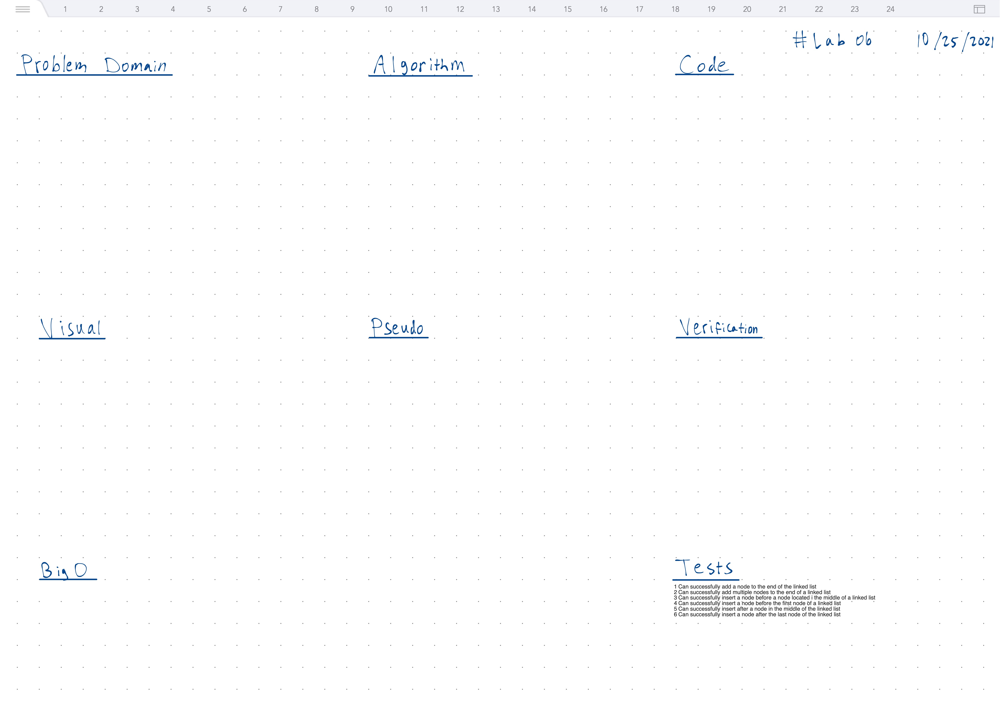

# LinkedList Insertions

Adding various insertion functionality

## Operations

- `+ insert(T) : void // O(1)`

## Properties

- `+ value : T`
- `+ next : node`

## Insert Algorithm O(1)

- construct new node(value)
- new node.next = head
- head = new node

## Whiteboard



## Tests

``` bash
npm run 'test:code-challenge-class-06'
```
