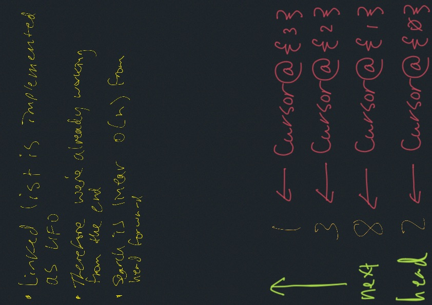

# LinkedList Kth Retrieval From End

Adding various insertion functionality

## Strategy

### Operations

- `+ kthFromEnd(k) : int // O(n)`

### Kth Search Algorithm O(n)

- if k exceeds list length, throw exception
- count (zero-based) backwards from list length - 1 to k
- return value of node at position k

## Whiteboards

Linked list Kth from end


## Tests

``` bash
cd javascript
npm run 'test:code-challenge-class-07'
```
