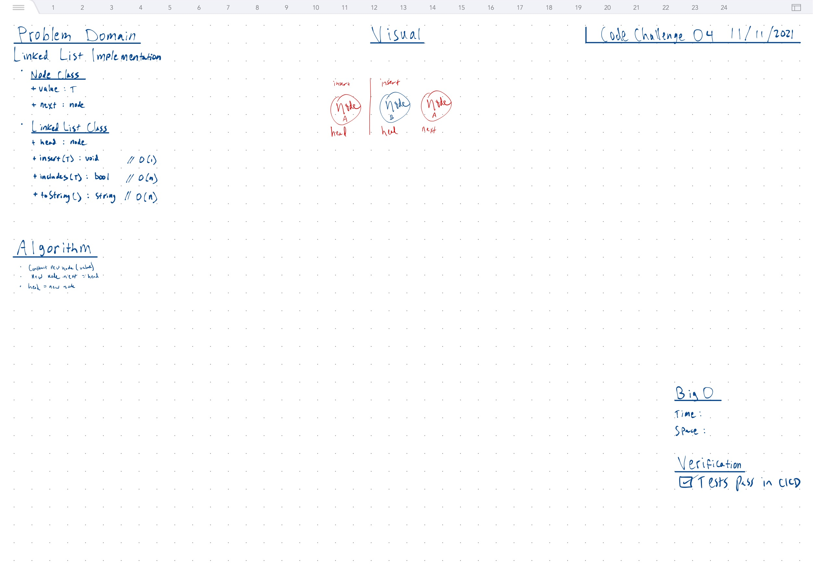

# LinkedList

We're just growing a LinkedList here.

## Operations

- `+ insert(T) : void // O(1)`
- `+ includes(T) : bool // O(n)`
- `+ toString() : string // O(n)`

## Properties

- `+ value : T`
- `+ next : node`

## Insert Algorithm O(1)

- construct new node(value)
- new node.next = head
- head = new node

## Whiteboard



## Tests

``` bash
npm run 'test:code-challenge-class-04'
```
