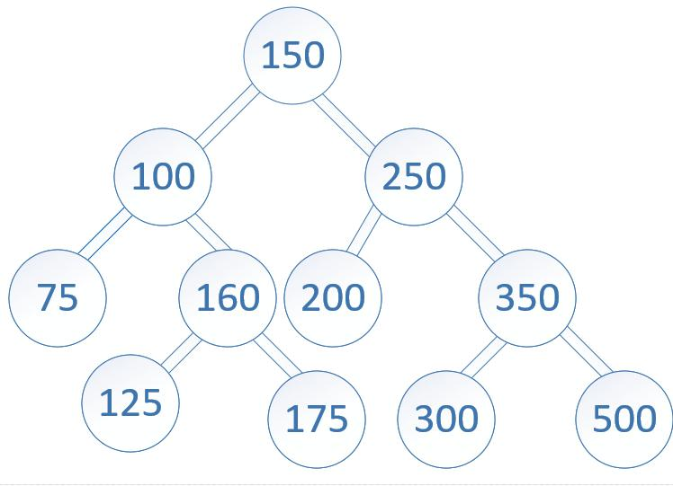
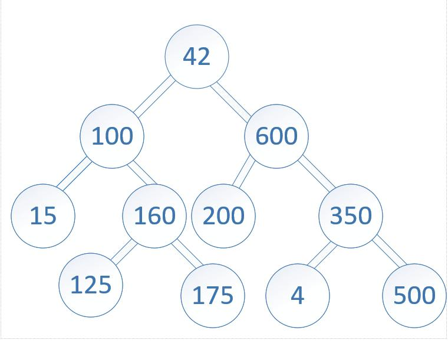

# Tree Intersection Challenge Summary
<!-- Description of the challenge -->

- Write a function called tree_intersection that takes two binary trees as parameters.
- Using your Hashmap implementation as a part of your algorithm, return a set of values found in both trees.

## Strategy

### Whiteboard Process
<!-- Embedded whiteboard image -->




### Approach & Efficiency
<!-- What approach did you take? Why? What is the Big O space/time for this approach? -->

I used a hashmap structure to collect the nodes in each tree.

I traversed the map since there is no previous join method in the structure.

I used an array to collect the joins from each hashmap.

The total space complexity is O(n) and time complexity is O(n).

### Solution
<!-- Show how to run your code, and examples of it in action -->

Tests can be run with `npm run test:code-challenge-class-32`.

## Tests

``` bash
cd javascript
npm run 'test:code-challenge-class-32'
```
